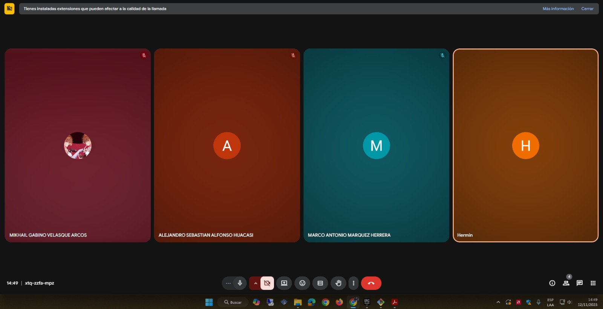
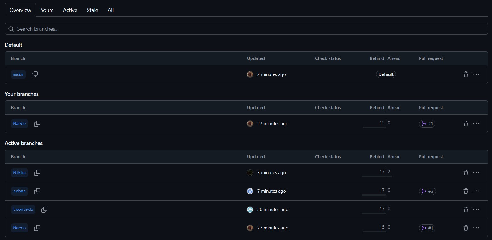

# Prac07 - Patrón Singleton

## Integrantes
- **Marquez Herrera Marco Antonio**
- **Velasque Arcos Mikhail Gabino**
- **Alfonso Huacasi Sebastian Alejandro**
- **Arce Mayhua Leonardo Ruben**

---

## Objetivos de la práctica
- Entender la estructura básica del patrón **Singleton**.  
- Aplicar Singleton cuando se requiere un **recurso global compartido**.  
- Manejar un **recurso crítico** que no debe duplicarse.  
- Integrar Singleton en un contexto con **múltiples clases y dependencias**.  
- Comprender cómo proteger el Singleton en **escenarios concurrentes (thread-safe)**.  

---

## Distribución de ejercicios

| Ejercicio | Descripción breve | Responsable |
|------------|------------------|--------------|
| **eje01** | Singleton básico: clase `Configuracion` con idioma y zona horaria. | **Mikhail Velasque** |
| **eje02** | Logger único que registra mensajes en un archivo. | **Leonardo Arce** |
| **eje03** | Simulación de conexión única a una base de datos. | **Sebastian Alfonso** |
| **eje04** | Control global del estado del juego. | **Marco Marquez** |
| **eje05** | Versión thread-safe del Logger o la conexión BD. | **Trabajo conjunto** |

---

## Cuestionario

### 1. ¿Qué desventajas tiene el patrón Singleton en pruebas unitarias?

**Marco:**  
El Singleton dificulta las pruebas porque mantiene estado global entre tests, lo que puede generar dependencias y resultados inconsistentes si no se reinicia la instancia entre casos.

**Mikhail:**  
Durante las pruebas unitarias, es complicado aislar el comportamiento del Singleton. Es necesario implementar métodos adicionales o usar reflexión para reiniciar su estado.

**Sebastián:**  
Al ser una única instancia, no se puede reemplazar fácilmente con mocks o stubs, afectando la independencia de los tests.

**Leonardo:**  
Hace que las pruebas no sean reproducibles si la instancia guarda datos entre ejecuciones. Además, viola el principio de inyección de dependencias.

---

### 2. ¿Cuándo no es recomendable usar Singleton?

**Marco:**  
Cuando se necesita escalabilidad o múltiples instancias, como en sistemas distribuidos o con diferentes configuraciones simultáneas.

**Mikhail:**  
Si el objeto no representa un recurso estrictamente global, el Singleton introduce acoplamiento innecesario y reduce la flexibilidad del sistema.

**Sebastián:**  
Cuando el ciclo de vida del objeto debe controlarse explícitamente o depende de un contexto, como conexiones por usuario o sesión.

**Leonardo:**  
No conviene si el sistema debe permitir varios entornos o configuraciones paralelas (por ejemplo, pruebas A/B o entornos de desarrollo y producción).

---

### 3. ¿Cómo se diferencia de una clase estática?

**Marco:**  
El Singleton crea una instancia única y permite controlar su ciclo de vida; una clase estática no tiene instancia y sus miembros existen todo el tiempo.

**Mikhail:**  
Las clases estáticas no pueden implementar interfaces ni heredar, mientras que un Singleton sí puede hacerlo y comportarse como un objeto real.

**Sebastián:**  
En el Singleton se puede inicializar recursos bajo demanda (lazy initialization), mientras que una clase estática se carga en memoria desde el inicio.

**Leonardo:**  
El Singleton puede ser destruido o reiniciado si se necesita; una clase estática permanece activa durante toda la ejecución del programa.

---

## Ejercicios desarrollados

Cada ejercicio cuenta con su propio `README.md` explicando la implementación, y en algunos casos, con diagramas UML o capturas de ejecución:

- `eje01/README.md`
- `eje02/README.md`
- `eje03/README.md`
- `eje04/README.md` 
- `eje05/README.md`
- 
## Evidencias de trabajo en equipo

Se adjuntan capturas que muestran la colaboración activa de todos los integrantes en el repositorio del proyecto:

---

## Entregable
Repositorio:  
> Contiene la carpeta **`prac07/`** con todos los ejercicios y documentación.  
> Cada integrante realizó su parte en una rama y se integró en `main` para la entrega final.
