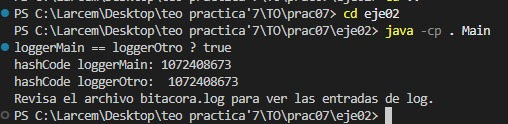

# Ejercicio 02 – Singleton con Recursos Compartidos

##  Descripción
El objetivo de este ejercicio es implementar una clase **`Logger`** que permita registrar mensajes en un archivo de texto (`bitacora.log`) garantizando que **solo exista una única instancia** de dicha clase durante toda la ejecución del programa.

Esto se logra mediante el **patrón de diseño Singleton**, el cual restringe la creación de objetos a una única instancia accesible globalmente.

---

##  Funcionamiento
1. **Clase `Logger`**
   - Usa el patrón Singleton para asegurar que solo haya una instancia.
   - Contiene el método `log(String mensaje)` que escribe la fecha, hora y mensaje en `bitacora.log`.
   - Está sincronizado para evitar conflictos entre hilos concurrentes.

2. **Clases adicionales**
   - `Main`: prueba principal del Logger.
   - `OtherComponent`: representa otro componente que también usa el mismo Logger.
   - `ThreadedTask`: simula tareas concurrentes que registran mensajes en el log.

3. **Ejecución**
   - Todas las clases obtienen la misma instancia de `Logger` mediante `Logger.getInstance()`.
   - Se escriben mensajes desde distintos puntos y hilos en el mismo archivo de log.

---

##  Ejemplo de ejecución



El resultado muestra que:
- **`loggerMain` y `loggerOtro` son la misma instancia** (`true`).
- **Ambos tienen el mismo `hashCode`**, confirmando el Singleton.
- Se indica que los mensajes se guardaron en `bitacora.log`.

---

##  Archivo generado: `bitacora.log`

Ejemplo de contenido:

```
2025-11-12 15:43:01 - [Main] Prueba de Singleton desde Main
2025-11-12 15:43:01 - [OtherComponent] Mensaje desde otro componente
2025-11-12 15:43:01 - [Thread A] Mensaje del hilo A
2025-11-12 15:43:01 - [Thread B] Mensaje del hilo B
2025-11-12 15:43:01 - [Thread C] Mensaje del hilo C
```

---

##  Conclusión
El ejercicio demuestra el uso efectivo del patrón **Singleton** para compartir un recurso (archivo de log) entre múltiples clases e hilos, asegurando un único punto de acceso y evitando inconsistencias al escribir datos concurrentemente.
