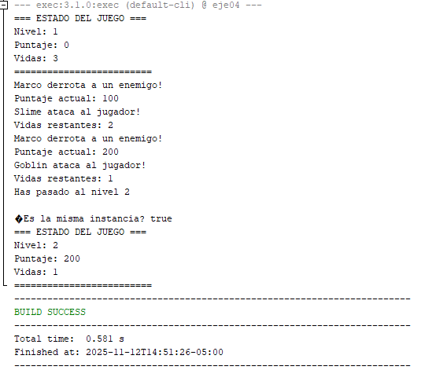
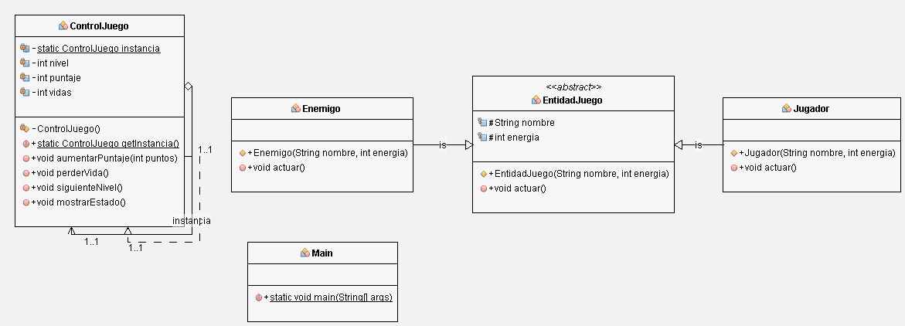

# Ejercicio 04 - Singleton en un Juego

## Objetivo
Desarrollar una clase `ControlJuego` que maneje el **estado global** de un juego (nivel actual, puntaje, vidas) usando el patrón **Singleton**.  
Todos los componentes del juego (jugador, enemigos, interfaz) deben acceder y modificar el **mismo estado compartido**.

---

## Descripción del ejercicio

En este ejercicio se implementó una pequeña simulación de juego con las siguientes clases:

- **ControlJuego (Singleton):**  
  Contiene el estado global del juego. Solo puede existir **una única instancia**.
  Administra las variables de nivel, puntaje y vidas, y provee métodos para modificarlas.

- **EntidadJuego (abstracta):**  
  Clase base para las entidades del juego. Define atributos comunes como `nombre` y `energía`.

- **Jugador:**  
  Hereda de `EntidadJuego` y representa al jugador.  
  Usa el `ControlJuego` para aumentar el puntaje al derrotar enemigos.

- **Enemigo:**  
  Hereda de `EntidadJuego` y representa a los enemigos.  
  Usa el `ControlJuego` para reducir las vidas del jugador al atacar.

- **Main:**  
  Simula el flujo del juego creando instancias de `Jugador` y `Enemigo` que interactúan con el `ControlJuego`.  
  Verifica también que todos los módulos compartan la misma instancia del Singleton.

---

## Implementación del Singleton

En la clase `ControlJuego` se aplica el patrón Singleton mediante:

```java
private static ControlJuego instancia;

private ControlJuego() { ... }

public static ControlJuego getInstancia() {
    if (instancia == null) {
        instancia = new ControlJuego();
    }
    return instancia;
}
```

De esta forma:
- Solo se crea una instancia la primera vez que se llama `getInstancia()`.
- Todas las clases que invoquen este método obtendrán **la misma referencia**.
- Así, `Jugador`, `Enemigo` y `MainJuego` comparten el mismo estado global del juego.

---

## Ejecución

En el `main`, distintos módulos (jugador y enemigos) acceden al mismo `ControlJuego`:

```java
ControlJuego control = ControlJuego.getInstancia();
Jugador jugador = new Jugador("Marco", 100);
Enemigo enemigo1 = new Enemigo("Slime", 50);
Enemigo enemigo2 = new Enemigo("Goblin", 60);

jugador.actuar();   // +100 puntos
enemigo1.actuar();  // -1 vida
control.mostrarEstado();
```

> Resultado esperado:  
> El estado mostrado es el mismo sin importar desde qué clase se acceda.

---

## Capturas de evidencia

### Ejecución del programa


### Diagrama UML


---

## Conclusión

El patrón **Singleton** permitió centralizar el estado del juego, garantizando que:
- Todos los componentes compartan la misma información global.
- No existan inconsistencias en los valores de nivel, puntaje y vidas.
- El código sea más fácil de mantener y extender.

